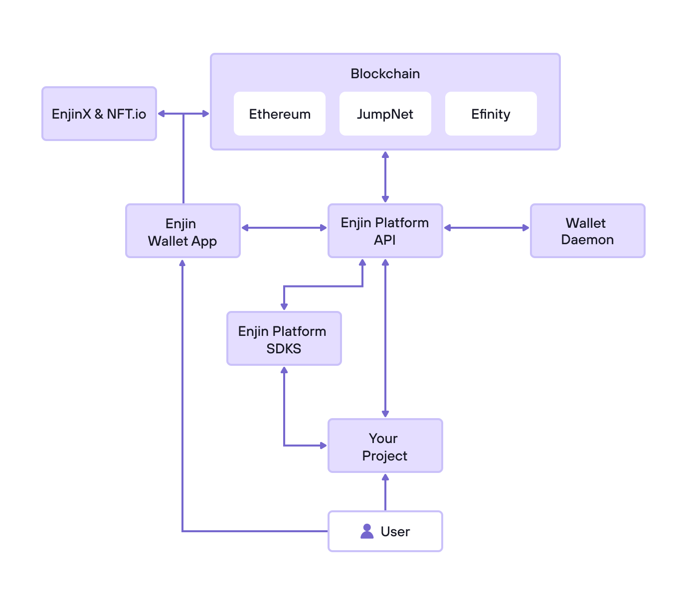

# Introductions

Introduction

Blockchain is type of shared database.

### sub section&#x20;

* Private
* Public

> Blockchain is the technology of future

<pre class="language-python" data-full-width="true"><code class="lang-python"><strong>print("hello world")
</strong></code></pre>

| Public Blockchain                               | Private Blockchain                                                               |
| ----------------------------------------------- | -------------------------------------------------------------------------------- |
| Public blockchain allows anyone to access them. | 
Private Blockchain is a permission blockchain  allows specific access.
 |
|                                                 |                                                                                  |
|                                                 |                                                                                  |


Blockchain is not Bitcoin.


$$
(a + b)^2 = a^2 + b^2 + 2ab
$$

<figure><figcaption></figcaption></figure>

